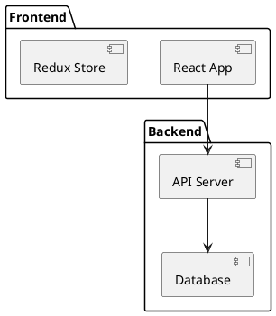
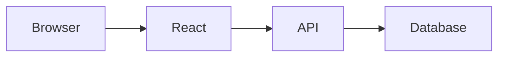

# Structure 문서화 가이드

## 📍 디렉토리 목적

프로젝트의 실제 구조를 1:1로 매핑하여 문서화합니다. 코드베이스의 아키텍처와 구성을 명확히 표현합니다.

## 📝 문서 작성 규칙

### 파일명 형식 (브랜치 기반)
```
{branch}_{number}_{path_or_component}.md
예: master_004_src_components.md
예: feature-db_001_database_schema.md
```

### 📌 브랜치 기반 번호 할당
**스크립트 사용 (권장):**
```bash
./.claude/scripts/claude-new-doc.sh structure "component_name"
# 자동: 브랜치 감지 → 번호 할당 → index.md 업데이트
```

**수동 생성 시:**
1. `.claude/context/index.md` 열기
2. 현재 브랜치 섹션에서 "다음 번호" 확인
3. `{branch}_{number}_{name}.md` 형식으로 생성
4. index.md 브랜치 섹션에 즉시 기록

### 디렉토리 구조
```
structure/
├── src/              # 실제 src 미러링
│   ├── components/
│   ├── services/
│   └── utils/
├── tests/            # 테스트 구조
└── docs/             # 문서 구조
```

## 📄 Structure 문서 템플릿

```markdown
# [번호]_[컴포넌트/경로] 구조

## 개요
[이 모듈/디렉토리의 목적과 역할]

## 파일 구성

| 파일명 | 목적 | 크기 | 최종수정 | 상태 |
|--------|------|------|----------|------|
| [파일.ts] | [용도] | [KB] | [날짜] | [활성/deprecated] |

## 디렉토리 트리
\`\`\`
src/components/
├── Auth/
│   ├── Login.tsx       # 로그인 컴포넌트
│   ├── Register.tsx    # 회원가입
│   └── AuthContext.tsx # 인증 컨텍스트
├── Layout/
│   ├── Header.tsx
│   └── Footer.tsx
└── index.ts           # 통합 export
\`\`\`

## 의존성 관계

### 외부 의존성
- react: 18.x
- axios: 1.x
- lodash: 4.x

### 내부 의존성
\`\`\`mermaid
graph TD
    A[Component] --> B[Service]
    B --> C[API Client]
    A --> D[Utils]
\`\`\`

## 주요 인터페이스/타입

\`\`\`typescript
export interface ComponentProps {
    id: string;
    data: DataType;
    onUpdate: (data: DataType) => void;
}

export type DataType = {
    // ...
}
\`\`\`

## 아키텍처 패턴

### 사용 패턴
- [패턴명]: [적용 위치 및 이유]

### 폴더 구조 규칙
- 컴포넌트: PascalCase
- 유틸리티: camelCase
- 상수: UPPER_SNAKE_CASE

## 데이터 흐름

\`\`\`mermaid
sequenceDiagram
    participant U as User
    participant C as Component
    participant S as Service
    participant A as API

    U->>C: Action
    C->>S: Request
    S->>A: HTTP Call
    A-->>S: Response
    S-->>C: Data
    C-->>U: Update UI
\`\`\`

## 변경 이력

| 날짜 | 변경내용 | 관련문서 |
|------|----------|----------|
| 2024-11-28 | 초기 생성 | [review 링크] |

## 관련 문서
- DKB: [아키텍처 패턴]
- Review: [구현 검토]
- Todo: [예정된 변경]

## 주의사항
- [중요 제약사항]
- [알려진 이슈]
- [성능 고려사항]
```

## 📊 다이어그램 작성

### PlantUML 사용


### Mermaid 사용


## ⚡ 동기화 규칙

### 업데이트 시점
- 파일 생성/삭제 시 즉시
- 구조 변경 시 즉시
- 주요 리팩토링 후
- 의존성 변경 시

### 동기화 체크
- [ ] 실제 파일 구조와 일치
- [ ] 파일 크기 정확
- [ ] 의존성 최신
- [ ] 다이어그램 현행화

## ✅ 체크리스트

### 작성 전
- [ ] 실제 구조 파악
- [ ] 의존성 분석
- [ ] 패턴 식별

### 작성 중
- [ ] 모든 중요 파일 포함
- [ ] 관계 명확히 표현
- [ ] 다이어그램 추가

### 작성 후
- [ ] Global numbering 할당
- [ ] context/index.md 업데이트
- [ ] 관련 문서 링크

## 📌 주의사항

- 실제 구조와 100% 일치 유지
- 임시 파일은 제외
- node_modules 등 제외
- 중요도에 따라 상세도 조절

## 🕐 Time MCP 필수 사용

**⚠️ Structure 문서의 모든 timestamp는 `mcp__time__get_current_time` 도구로 조회하세요.**

### 적용 위치
- 최종수정 날짜
- 변경 이력 날짜

### ❌ 금지
- 시간 추측 금지
- 이전 시간 재사용 금지