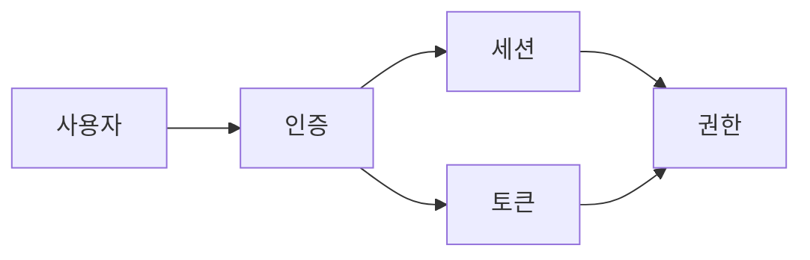

# [번호]_[카테고리] 용어집

## 메타데이터
- 카테고리: [Technical/Business/Abbreviation/Project]
- 최종 업데이트: YYYY-MM-DD
- 용어 수: [N개]

## 용어 목록

### [용어명] {#term-id}

**한글명**: [한글 표기]
**영문명**: [English Name]
**약어**: [있다면]

**정의**:
[명확하고 간결한 정의]

**상세 설명**:
[필요시 추가 설명, 맥락, 배경]

**사용 예시**:
```typescript
// 코드에서 사용 예
const authentication: AuthType = {...};
```

**관련 용어**:
- [관련 용어 1]
- [관련 용어 2]

**참조**:
- 첫 사용: [문서 링크]
- 구현: [코드 파일 경로]
- DKB: [관련 지식 문서]

---

### [용어 2] {#term-id-2}

[동일한 구조 반복]

---

## 약어 빠른 참조

| 약어 | 전체 이름 | 설명 |
|------|-----------|------|
| [약어] | [Full Name] | [간단한 설명] |

## 도메인 용어 맵



## 용어 변경 이력

| 날짜 | 용어 | 변경 내용 | 이유 |
|------|------|-----------|------|
| YYYY-MM-DD | [용어] | [변경사항] | [이유] |

## 색인 (가나다순)

### ㄱ
- [권한](#authorization)

### ㅇ
- [인증](#authentication)
- [암호화](#encryption)

### A-Z
- [API](#api)
- [Database](#database)

## 문서 동기화
- [ ] context/index.md에 번호 등록
- [ ] lexicon/000_overview.md 업데이트
- [ ] current.md에 링크 추가
- [ ] 알파벳/가나다 순 정렬 확인