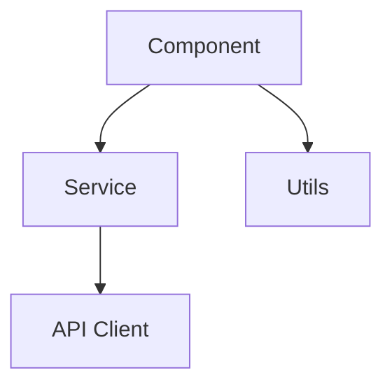
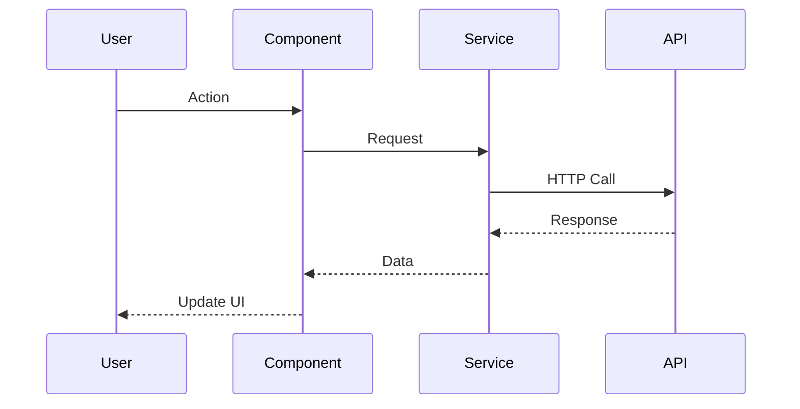

# [번호]_[컴포넌트/경로] 구조

## 개요
[이 모듈/디렉토리의 목적과 역할]

## 파일 구성

| 파일명 | 목적 | 크기 | 최종수정 | 상태 |
|--------|------|------|----------|------|
| [파일.ts] | [용도] | [KB] | [날짜] | [활성/deprecated] |

## 디렉토리 트리
```
src/components/
├── Auth/
│   ├── Login.tsx       # 로그인 컴포넌트
│   ├── Register.tsx    # 회원가입
│   └── AuthContext.tsx # 인증 컨텍스트
├── Layout/
│   ├── Header.tsx
│   └── Footer.tsx
└── index.ts           # 통합 export
```

## 의존성 관계

### 외부 의존성
- [패키지]: [버전]
- [패키지]: [버전]

### 내부 의존성


## 주요 인터페이스/타입

```typescript
export interface ComponentProps {
    id: string;
    data: DataType;
    onUpdate: (data: DataType) => void;
}

export type DataType = {
    // ...
}
```

## 아키텍처 패턴

### 사용 패턴
- [패턴명]: [적용 위치 및 이유]

### 폴더 구조 규칙
- 컴포넌트: PascalCase
- 유틸리티: camelCase
- 상수: UPPER_SNAKE_CASE

## 데이터 흐름



## 변경 이력

| 날짜 | 변경내용 | 관련문서 |
|------|----------|----------|
| YYYY-MM-DD | 초기 생성 | [review 링크] |

## 관련 문서
- DKB: [아키텍처 패턴]
- Review: [구현 검토]
- Todo: [예정된 변경]

## 주의사항
- [중요 제약사항]
- [알려진 이슈]
- [성능 고려사항]

## 문서 동기화
- [ ] context/index.md에 번호 등록
- [ ] structure/000_overview.md 업데이트
- [ ] current.md 업데이트